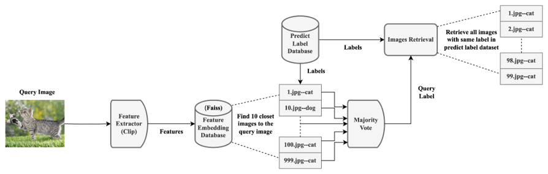

## Image Retrieval

### Introduction
Description: Image-to-image retrieval is a task that aims to find images in a large
database that are similar to a given query image

### Dataset
- Dataset is derived from parts of the Animal-10
- Total 10 category, including dog, cat, horse, elephant, butterfly, chicken, cow, sheep, squirrel, and spider
- 10000 images for training, and 1000 images for testing

### Evaluation
- Precision and Recall
  - Precision = A / B
    - A: # of relevant retrieved images
    - B: # of total retrieved images
  - Recall = A / C
    -  C: # of relevant images in database
  - Speed
    - Measure the execution time

### Training

### Construct Database

### Retrieval
